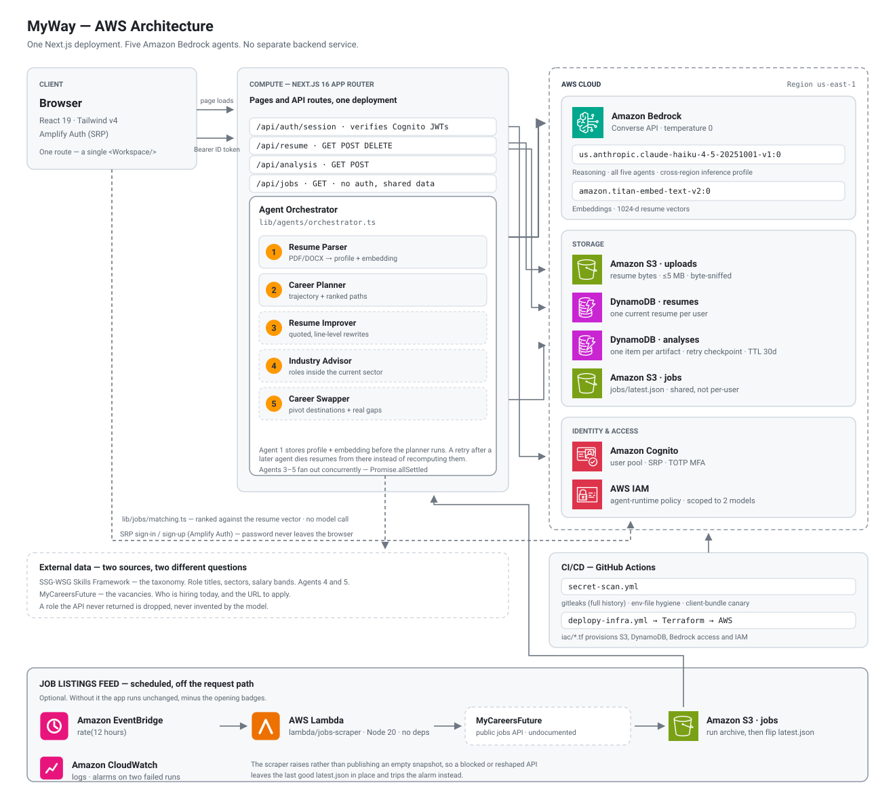
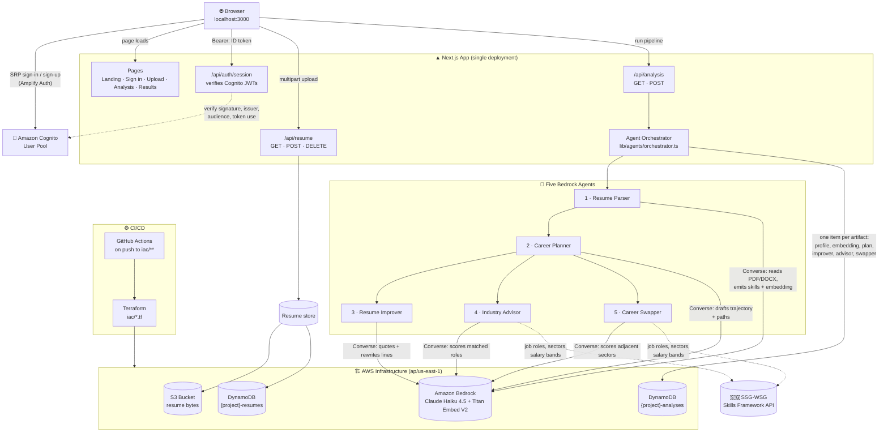
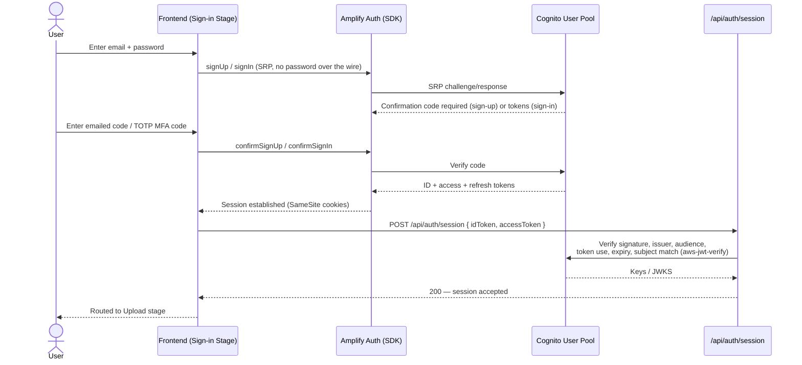
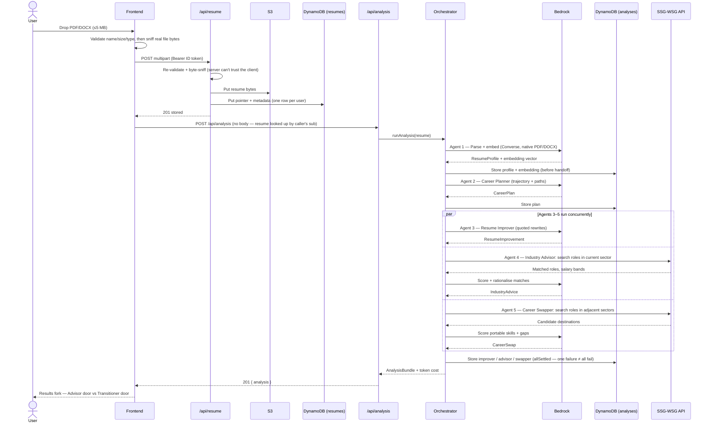
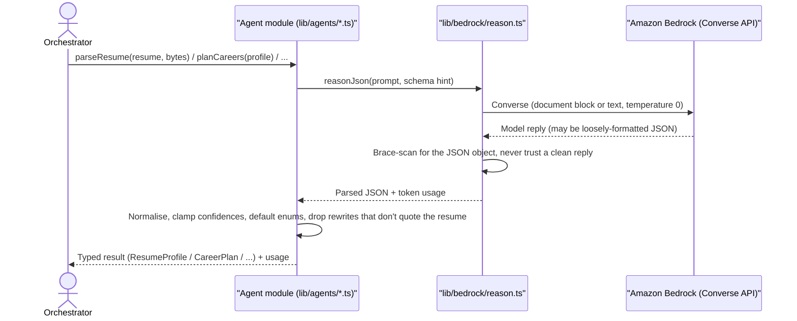

<h1 align="center">MyWay</h1>

<p align="center">
  
</p>

<p align="center">
  Upload a resume once. Five Amazon Bedrock agents read it, plan around it, rewrite it,<br/>
  and check it against live Singapore job-market data — so a career switch stops being a guess.
</p>

---

## Tech Stack

### Frontend
<p>
  <a href="https://skillicons.dev"></a>
</p>
<p>
  
  
  
  
</p>

### AI / Agents
<p>
  
  
  
</p>

### AWS Services

<table>
  <tr>
    <td align="center" width="132">
      <br />
      <sub><b>Amazon Bedrock</b><br />Converse API</sub>
    </td>
    <td align="center" width="132">
      <br />
      <sub><b>Amazon S3</b><br />resume bytes</sub>
    </td>
    <td align="center" width="132">
      <br />
      <sub><b>Amazon DynamoDB</b><br />resumes + analyses</sub>
    </td>
    <td align="center" width="132">
      <br />
      <sub><b>Amazon Cognito</b><br />SRP + TOTP MFA</sub>
    </td>
    <td align="center" width="132">
      <br />
      <sub><b>AWS IAM</b><br />agent-runtime policy</sub>
    </td>
  </tr>
</table>

### Infrastructure & CI

<p>
  
  
  
</p>

### External Data
<p>
  
</p>

---

## Architecture Overview

Everything is one Next.js app: pages and API routes ship from the same codebase, deployed as a single unit. There is no separate backend service — `src/app/api/*` route handlers are the server, calling AWS directly with the runtime's own credentials.

<p align="center">
  <picture>
    <source media="(prefers-color-scheme: dark)" srcset="docs/img/architecture-dark.svg" />
    
  </picture>
</p>

<sub>Icons: <a href="https://aws.amazon.com/architecture/icons/">AWS Architecture Icons</a>. Diagram regenerated with <code>node scripts/gen-architecture.js docs/img</code>.</sub>

### The same thing as a flow graph

Where the diagram above shows *what* is deployed, this shows *what calls what* — including the ordering rule the orchestrator enforces.



---

## Key Flows

### Sign-in (Amazon Cognito via Amplify Auth)



### Resume upload → five-agent analysis



### AI Content Generation (per agent)




---

## The five agents

| # | Agent | File | Reads | Produces |
|---|-------|------|-------|----------|
| 1 | Resume Parser | `lib/agents/resume-parser.ts` | Raw PDF/DOCX bytes (Bedrock document block) | Structured `ResumeProfile` + a Titan embedding |
| 2 | Career Planner | `lib/agents/career-planner.ts` | The profile | `CareerPlan` — current trajectory + ranked paths |
| 3 | Resume Improver | `lib/agents/resume-improver.ts` | Profile + plan + original document | Quoted, line-level rewrites with impact ratings |
| 4 | Industry Advisor | `lib/agents/industry-advisor.ts` | Profile, embedding, sector, SSG-WSG roles | Roles inside the current sector, ranked by fit |
| 5 | Career Swapper | `lib/agents/career-swapper.ts` | Profile, embedding, adjacent-sector roles | Pivot destinations + skills that transfer |

Orchestration (`lib/agents/orchestrator.ts`) enforces one rule: **nothing reaches the planner until the parser's output is durably stored**, so a failed run is resumable from the expensive step. Agents 3–5 then fan out with `Promise.allSettled`, so one specialist failing (e.g. no SSG credentials) still returns a usable bundle — see [ADR-0002](docs/adr/0002-claude-haiku-for-grounded-advice.md) for why Claude Haiku 4.5 replaced Nova Lite as the reasoning model, and what it costs.

---

## User Flow

The whole app is a **single route** (`/`); every phase is a state of the `<Workspace/>` component.

1. **Landing** — value proposition, no auth required.
2. **Sign in** — Amazon Cognito through Amplify Auth: email/password sign-up, emailed confirmation code, SRP login, optional TOTP MFA. See [`docs/auth/cognito.md`](docs/auth/cognito.md).
3. **Upload** — drag-and-drop or browse for a PDF/DOCX (≤5 MB). Validated twice: once on declared name/size/type, once by sniffing the actual file bytes server-side so a renamed file can't slip through.
4. **Analysis** — a live trace shows the parser and planner working (with the three specialists folded into the planner's card), while the real request runs server-side.
5. **Results fork** — two doors:
   - **Advisor** — stay in your current industry: the plan, the resume rewrites, and roles matched inside your sector.
   - **Transitioner** — switch industries: pivot destinations, portable skills, and what's missing to get there.
   A door with no data (e.g. the market agents were skipped) is disabled, not hidden.

---

## Prerequisites

| Tool | Min Version | Notes |
|------|-------------|-------|
|  | 20.9 (22.x recommended) | Frontend dev server |
| npm | 10+ | Ships with Node |
| AWS account | — | Bedrock model access, Cognito user pool, S3, DynamoDB — no local emulation |
| Terraform | 1.x | Only needed to provision/modify `iac/` |
| SSG-WSG credentials | — | Optional — powers the Industry Advisor & Career Swapper agents |

---

## Environment Setup

### 1 — Provision AWS infrastructure (optional if it already exists)

```bash
cd iac
terraform init
terraform plan
terraform apply
```

This creates the S3 uploads bucket, the `{project}-resumes` and `{project}-analyses` DynamoDB tables, and resolves the two Bedrock model IDs. `terraform output` gives you every value the frontend `.env.local` needs. `create_iam` is off by default (the dev sandbox restricts IAM writes) — flip it on when deploying somewhere with a real execution role. CI applies this automatically via `.github/workflows/deplopy-infra.yml` on pushes to `iac/**`.

Enable model access once per account, in the Bedrock console → **Model access**, for `anthropic.claude-haiku-4-5-20251001-v1:0` and `amazon.titan-embed-text-v2:0`.

Haiku 4.5 is invoked through a cross-region inference profile, so the ID the app uses carries a `us.` prefix that the console does not show. Take it from `terraform output bedrock_reasoning_model_id` rather than typing it.

### 2 — Create a Cognito user pool

Application code expects an existing pool and does not provision one. Follow [`docs/auth/cognito.md`](docs/auth/cognito.md) — email as username, SRP-only public app client (no secret), TOTP MFA, refresh-token rotation.

### 3 — (Optional) Get SSG-WSG credentials

Register at [developer.swda.gov.sg](https://developer.swda.gov.sg) → your app → Credentials, for `SSG_CLIENT_ID` / `SSG_CLIENT_SECRET`. Without these the Industry Advisor and Career Swapper agents are skipped; the parser, planner, and improver still run.

### 4 — `frontend/meong-my-way/.env.local`

```dotenv
# Public Cognito identifiers — bundled into the browser, not secrets themselves.
NEXT_PUBLIC_COGNITO_USER_POOL_ID=ap-southeast-1_xxxxxxxxx
NEXT_PUBLIC_COGNITO_USER_POOL_CLIENT_ID=xxxxxxxxxxxxxxxxxxxxxxxxxx

# --- Server-only. Never prefix with NEXT_PUBLIC_. ---------------------------
AWS_REGION=us-east-1

# From `terraform output` in iac/.
S3_BUCKET_NAME=meong-myway-uploads-000000000000
DYNAMODB_RESUMES_TABLE=meong-myway-resumes
DYNAMODB_ANALYSES_TABLE=meong-myway-analyses

# Omit locally to use your own AWS CLI credentials; omit entirely when deployed
# and let the task/instance role supply them.
AWS_ACCESS_KEY_ID=
AWS_SECRET_ACCESS_KEY=
AWS_SESSION_TOKEN=

# --- Amazon Bedrock ----------------------------------------------------------
BEDROCK_REGION=us-east-1
BEDROCK_REASONING_MODEL_ID=us.anthropic.claude-haiku-4-5-20251001-v1:0
BEDROCK_EMBEDDING_MODEL_ID=amazon.titan-embed-text-v2:0

# --- SkillsFuture (SSG-WSG) Skills Framework API ------------------------------
SSG_CLIENT_ID=
SSG_CLIENT_SECRET=
```

Copy the template and fill it in:

```bash
cp frontend/meong-my-way/.env.example frontend/meong-my-way/.env.local
```

---

## Running the Application

```bash
cd frontend/meong-my-way
npm install
npm run dev
```

Then open **http://localhost:3000**. Restart the dev server after changing any `.env.local` value.

### Scripts

| Command | What it does |
|---------|--------------|
| `npm run dev` | Dev server with hot reload (Turbopack) |
| `npm run build` | Production build |
| `npm run start` | Serve the production build |
| `npm run lint` | ESLint |
| `npm run test` | Vitest — unit project |
| `npm run test:watch` | Vitest — unit project, watch mode |
| `npm run test:integration` | Vitest — integration project (hits real Bedrock/AWS where configured) |

---

## Port Reference

| Service | Badge | URL |
|---------|-------|-----|
| Frontend + API routes |  | http://localhost:3000 |
| Cognito, Bedrock, S3, DynamoDB, SSG-WSG | — | External AWS / govt services — no local host port |

---

## Source Layout

```
frontend/meong-my-way/src/
├── app/
│   ├── api/
│   │   ├── auth/session/route.ts   # verifies Cognito JWTs server-side
│   │   ├── resume/route.ts         # GET/POST/DELETE the caller's stored resume
│   │   └── analysis/route.ts       # GET last run / POST to run the 5 agents
│   ├── globals.css                 # design tokens (light/dark), Tailwind v4 config
│   ├── layout.tsx
│   └── page.tsx                    # renders <Workspace/>
├── components/
│   ├── workspace.tsx                # the stage machine — all pipeline state lives here
│   ├── app-header.tsx               # header + progress stepper
│   ├── stages/                      # one component per phase of the flow
│   │   ├── landing-stage.tsx
│   │   ├── sign-in-stage.tsx
│   │   ├── upload-stage.tsx
│   │   ├── analysis-stage.tsx
│   │   ├── results-choice-stage.tsx # the fork: Advisor vs Transitioner
│   │   ├── advisor-stage.tsx
│   │   └── transitioner-stage.tsx
│   └── ui/                          # primitives, icons, stepper, agent trace, path card
└── lib/
    ├── contracts.ts       # shared types — the agent/API contract
    ├── agents/            # the 5 agents + orchestrator + cost estimator
    ├── bedrock/           # Converse wrapper (reason.ts) + embeddings.ts
    ├── ssg/                # SSG-WSG API client + OAuth token cache
    ├── resume/             # upload validation, S3/DynamoDB store, client, pipeline
    ├── analysis/           # browser-side client for /api/analysis
    ├── auth/               # Amplify client wrapper, server-side JWT verification, route guard
    └── aws/clients.ts      # shared Bedrock/DynamoDB/S3 SDK clients
```

### Styling

Tailwind v4, configured entirely in `src/app/globals.css` — there is no `tailwind.config.js`. Colors are CSS custom properties on `:root`, mapped to utilities through `@theme inline`, so `bg-surface`, `text-ink-2`, `border-hairline` and friends resolve in both light and dark mode. Dark mode follows the OS setting and also honours an explicit `data-theme="dark"` stamp on `<html>`.

---

## Security — keeping credentials out of the repo and the bundle

Two different leaks are possible here, so CI checks for both.
[`.github/workflows/secret-scan.yml`](.github/workflows/secret-scan.yml) runs on
every push and pull request, needs no repository secrets of its own (so it works
on forks), and also runs weekly — history does not change, but gitleaks' rules
do, so a credential format that had no rule when it was committed gets caught later.

| Job | Asks | How |
|-----|------|-----|
| **Committed secrets** | Has a credential ever been committed? | [gitleaks](https://github.com/gitleaks/gitleaks) over the **full history** (`fetch-depth: 0`), redacted so the Actions log never reprints the key it just found |
| **Env-file hygiene** | Could a credential be committed *next* time? | No tracked `.env*` (except the template) or `.tfstate`/`.tfvars`; `.gitignore` is asserted to cover every env variant; no `NEXT_PUBLIC_` name shaped like a secret; no client component reading a server-only `process.env` |
| **Client bundle leak** | Did a credential reach the browser? | Builds the app with canary values in the server-only variables, then greps `.next/static` for them |

### The rule that matters most

**Anything prefixed `NEXT_PUBLIC_` is inlined into the browser bundle by Next.js.**
An AWS secret key with that prefix is published to every visitor. Server-side
values are read only in modules that `import "server-only"` (see
`lib/aws/clients.ts`), and CI fails the build if a `NEXT_PUBLIC_` variable is
named like a credential.

The bundle-canary job is deliberately narrow in scope, and it is worth knowing why.
Next.js does **not** inline a non-`NEXT_PUBLIC_` variable into the client bundle even
when a client component reads it directly — that was measured against this app, which
is why the naming check above is the primary control. What the canary job catches is
the config-level leak no naming rule can see: an `env` block in `next.config.ts`, a
DefinePlugin, or any future bundler change that starts inlining server values.

### False positives

`.gitleaks.toml` allowlists exactly two things, each scoped to a rule *and* a path
rather than a bare path — the AWS SDK's `Key:` object-path parameter in TS/JS
(a hardcoded `Key: "sk_live_..."` literal still fails), and `.terraform.lock.hcl`,
which is committed on purpose and is entirely checksums.

`.env.example` is deliberately **not** allowlisted: it is the file most likely to
receive a real credential pasted in by accident, so it is scanned harder than the
rest of the tree, not less.

### If the scan fails on a real credential

**Rotate it first.** It is on GitHub's servers and in every clone; rewriting history
does not un-publish it, and rotation is the only step that actually revokes access.
Then remove it from the tree, confirm `.gitignore` covers the path, and only then
consider `git filter-repo`.

---

## Troubleshooting

**Frontend shows "Sign in is not configured"**
Cognito user pool ID/client ID are missing or wrong in `.env.local`. Verify the pool exists and the app client is public (no secret) per `docs/auth/cognito.md`.

**Resume upload returns 503 "Resume storage is not configured yet"**
`AWS_REGION`, `S3_BUCKET_NAME`, or `DYNAMODB_RESUMES_TABLE` is missing/misnamed. Re-run `terraform output` in `iac/` and copy the values exactly.

**`POST /api/analysis` returns 502 with `retryable: true`**
A Bedrock call failed (throttling or a malformed model reply) — this is `AgentReasoningError` from `lib/bedrock/reason.ts`; retrying usually succeeds. Check the model is enabled under Bedrock → Model access.

**Industry Advisor / Career Swapper doors are disabled on the results screen**
`SSG_CLIENT_ID` / `SSG_CLIENT_SECRET` are unset, or the SSG-WSG API rejected them. The pipeline logs this as a warning and skips both agents rather than failing the whole run — set `SSG_API_BASE_URL=https://mock-public-api.ssg-wsg.sg` to develop against canned data.

**`terraform apply` fails on IAM resources**
`create_iam` defaults to `false` because the dev sandbox account restricts IAM writes. Leave it off for local development; the app runs on your own AWS CLI credentials instead of a task role.

**Bedrock returns `ValidationException: Invocation of model ID ... with on-demand throughput isn't supported`**
`BEDROCK_REASONING_MODEL_ID` is set to the bare foundation-model ID. Claude 4.x on Bedrock is inference-profile-only — the ID needs its geography prefix (`us.anthropic.claude-haiku-4-5-20251001-v1:0`). Take it from `terraform output bedrock_reasoning_model_id`; the Bedrock console shows the unprefixed ID, which is the one that fails.

**Bedrock returns `AccessDeniedException` intermittently**
A cross-region inference profile is authorised against the profile *and* against the foundation model in whichever region it routed to, so a policy granting only one of them fails on some requests and not others. `iac/bedrock.tf` expands both, reading the region list from the profile itself.

**Analysis takes a long time / times out on serverless**
Five sequential-then-parallel model calls plus SSG lookups can run long; `maxDuration = 300` is set on the route, but some platforms (e.g. Vercel Hobby) cap function duration lower regardless — the client already treats a timeout as retryable.
