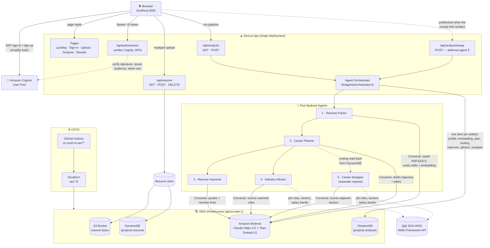
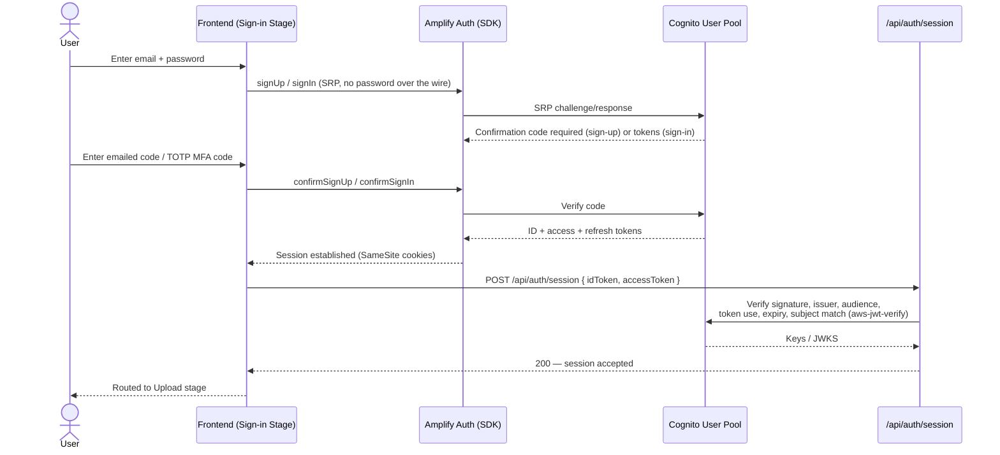
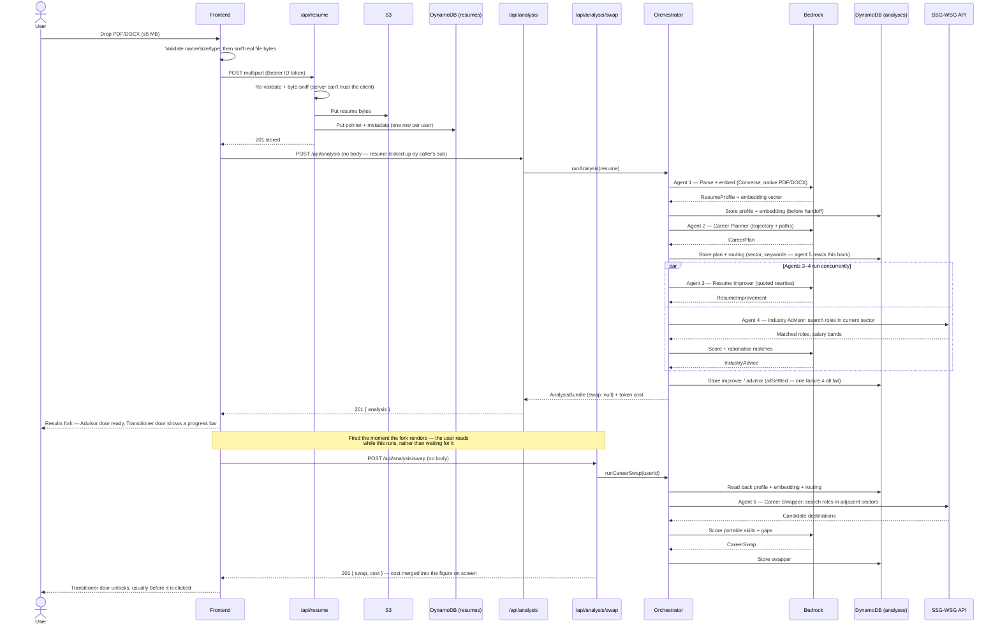
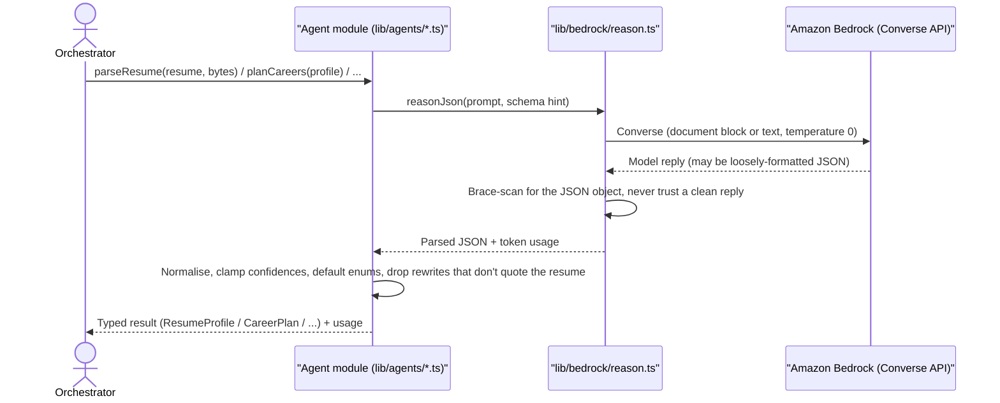

<h1 align="center">MyWay</h1>

<p align="center">
  
</p>

<p align="center">
  Upload a resume once. Five Amazon Bedrock agents read it, plan around it, rewrite it,<br/>
  and check it against live Singapore job-market data — so a career switch stops being a guess.
</p>

---

## Tech Stack

### Frontend
<p>
  <a href="https://skillicons.dev"></a>
</p>
<p>
  
  
  
  
</p>

### AI / Agents
<p>
  
  
  
</p>

### AWS Services

<table>
  <tr>
    <td align="center" width="132">
      <br />
      <sub><b>Amazon Bedrock</b><br />Converse API</sub>
    </td>
    <td align="center" width="132">
      <br />
      <sub><b>Amazon S3</b><br />resume bytes</sub>
    </td>
    <td align="center" width="132">
      <br />
      <sub><b>Amazon DynamoDB</b><br />resumes + analyses</sub>
    </td>
    <td align="center" width="132">
      <br />
      <sub><b>Amazon Cognito</b><br />SRP + TOTP MFA</sub>
    </td>
    <td align="center" width="132">
      <br />
      <sub><b>AWS IAM</b><br />agent-runtime policy</sub>
    </td>
  </tr>
</table>

### Infrastructure & CI

<p>
  
  
  
</p>

### External Data
<p>
  
</p>

---

## Architecture Overview

Everything is one Next.js app: pages and API routes ship from the same codebase, deployed as a single unit. There is no separate backend service — `src/app/api/*` route handlers are the server, calling AWS directly with the runtime's own credentials.

<p align="center">
  <picture>
    <source media="(prefers-color-scheme: dark)" srcset="docs/img/architecture-dark.svg" />
    
  </picture>
</p>

<sub>Icons: <a href="https://aws.amazon.com/architecture/icons/">AWS Architecture Icons</a>. Diagram regenerated with <code>node scripts/gen-architecture.js docs/img</code>.</sub>

### The same thing as a flow graph

Where the diagram above shows *what* is deployed, this shows *what calls what* — including the ordering rule the orchestrator enforces.



---

## Key Flows

### Sign-in (Amazon Cognito via Amplify Auth)



### Resume upload → five-agent analysis

Note the split at the end: **agents 1–4 run in the POST the user waits on, agent 5 runs in a second request the results screen fires for itself.** Why is in [Latency](#latency--why-agent-5-runs-separately).



### AI Content Generation (per agent)




---

## The five agents

| # | Agent | File | Reads | Produces |
|---|-------|------|-------|----------|
| 1 | Resume Parser | `lib/agents/resume-parser.ts` | Raw PDF/DOCX bytes (Bedrock document block) | Structured `ResumeProfile` + a Titan embedding |
| 2 | Career Planner | `lib/agents/career-planner.ts` | The profile | `CareerPlan` — current trajectory + ranked paths |
| 3 | Resume Improver | `lib/agents/resume-improver.ts` | Profile + plan + original document | Quoted, line-level rewrites with impact ratings |
| 4 | Industry Advisor | `lib/agents/industry-advisor.ts` | Profile, embedding, sector, SSG-WSG roles | Roles inside the current sector, ranked by fit |
| 5 | Career Swapper | `lib/agents/career-swapper.ts` | Profile, embedding, adjacent-sector roles | Pivot destinations, portable skills, coach referrals |

Orchestration (`lib/agents/orchestrator.ts`) enforces one rule: **nothing reaches the planner until the parser's output is durably stored**, so a failed run is resumable from the expensive step. Agents 3 and 4 then fan out with `Promise.allSettled`, so one specialist failing (e.g. no SSG credentials) still returns a usable bundle. Agent 5 is deliberately outside that fan-out — see [Latency](#latency--why-agent-5-runs-separately). For why Claude Haiku 4.5 replaced Nova Lite as the reasoning model, and what it costs, see [ADR-0002](docs/adr/0002-claude-haiku-for-grounded-advice.md).

### Latency — why agent 5 runs separately

Measured end to end against a real résumé:

| Phase | Duration |
|---|---|
| Resume Parser | 9.4s |
| Career Planner | 24.9s |
| Resume Improver ┐ | 12.0s |
| Industry Advisor ┤ concurrent | 10.7s |
| **Career Swapper** ┘ | **31.5s** |
| **Total, all five in one request** | **69s** |

The swapper set the wall clock on its own, and it is the one agent whose output the results screen does not show: that screen is a fork, and someone who picks *"further my career"* never opens the swapper's half. Every user was waiting ~20s for output half of them would not look at.

So it moved to `POST /api/analysis/swap`, which the browser fires **when the fork renders** rather than when the Transitioner door is clicked. The work now overlaps with reading instead of with waiting, and is usually finished before the click arrives.

| | Before | After |
|---|---|---|
| First usable screen | 69s | **~50s** |
| Transitioner click | instant | instant (prefetched) |
| Cost | one bill | unchanged — the swap response returns its own `RunCost`, merged into the figure on screen |

Two consequences worth knowing:

- **The planner's routing is persisted.** A second request has nothing in memory, so `sector` and `adjacentKeywords` are written to DynamoDB as a `routing` artifact and read back by `runCareerSwap`. That is what makes agent 5 relocatable at all.
- **`swap: null` now means three different things** — not asked for yet, in flight, or failed. The browser tracks `SwapRequestState` separately, because those render as a progress bar, a progress bar, and a retry button respectively. Reading an absent `swap` as failure is what previously made the fork claim *"the career swapper could not be reached"* during every normal 30-second window.

### How agents 4 and 5 handle a silent framework

The two market-facing agents depend on an external API that can return nothing —
because a résumé genuinely has no published match, because credentials are
unset, or because the endpoint rejected the query. Those look identical from
inside the pipeline, and the first version treated all three the same way: the
agent returned `null` and the UI said no matches were found. For someone who
opened the Transitioner door specifically to ask "what else could I do?", that
reads as *there is nowhere for you to go* — a claim the app had no basis to
make.

So each of them now runs in two tiers, and reports which one answered:

| `basis` | Source | Salary bands |
|---|---|---|
| `framework` | Real Skills Framework roles, re-ranked against the résumé embedding | The framework's published monthly figures |
| `reasoned` | The model's own account of the Singapore market | Estimates, labelled as such in the UI |

The grounded tier is always tried first and is strongly preferred — it is the
reason the Skills Framework is wired in at all. The reasoning tier exists so
that an API outage costs the user some precision rather than their entire
answer. The distinction reaches the browser because it changes how much weight
a reader should give a number, and the two are indistinguishable in the cards
themselves.

Both tiers end the Transitioner branch with **real, publicly funded career
coaching services** (`lib/agents/coaches.ts`). That list is a verified constant,
never model output — a hallucinated agency or dead link is the one failure here
whose cost lands outside the browser. The model only writes *what to ask* once
the user gets there, tailored to the destinations it just produced.

---

## User Flow

The whole app is a **single route** (`/`); every phase is a state of the `<Workspace/>` component.

1. **Landing** — value proposition, no auth required.
2. **Sign in** — Amazon Cognito through Amplify Auth: email/password sign-up, emailed confirmation code, SRP login, optional TOTP MFA. See [`docs/auth/cognito.md`](docs/auth/cognito.md).
3. **Upload** — drag-and-drop or browse for a PDF/DOCX (≤5 MB). Validated twice: once on declared name/size/type, once by sniffing the actual file bytes server-side so a renamed file can't slip through.
4. **Analysis** — a live trace draws the real fan-out: one card per agent, each with its own progress bar and step list. The Career Swapper's card reads **Queued** throughout, because it genuinely has not started — it is not part of this request.
5. **Results fork** — two doors:
   - **Advisor** — stay in your current industry: the plan, the resume rewrites, and roles matched inside your sector.
   - **Transitioner** — switch industries: pivot destinations, portable skills, what's missing to get there, and where to speak to a real career coach about it.

   The Transitioner door carries a progress bar while agent 5 runs behind it, then unlocks. A door with no data is disabled rather than hidden, and says which of the three reasons applies: still working, found nothing, or could not be reached (with a retry).

### Presenting paths — one comparison, not a stack of cards

Both branches render their paths through `ComparePaths` (`components/ui/compare-paths.tsx`): a tab strip across the destinations, and beneath it a table whose rows are fixed — *the role · why you · what carries over · what's missing · time and pay · the route*.

It replaced a column of expandable cards, which put four destinations × seven sections on one page and asked the reader to hold the differences in their head. A stable frame is what lets someone diff two options: switching tabs changes the answers, never the questions. The left column is the reader's own résumé, so each row reads as a delta — and where a résumé genuinely cannot answer a row (nobody's CV states the salary of a job they have not taken) the row says so instead of inventing a baseline.

The tab strip is hand-rolled rather than pulled from a component library: this project has no Radix, and adding it for one control would bring a second styling vocabulary. The keyboard contract is the part that matters and is implemented in full — arrow keys move between tabs, Home/End jump to the ends, and only the selected tab is in the page's tab order.

### Progress that does not lie

Two different bars, because two different things are known.

**Agent cards** derive from real state: `done / total` steps, with a running step counting **half**. Half is not a claim about the step's internals — nothing reports those — it is what stops the bar freezing for a whole step and then jumping a third at once.

**The career swapper** is a single round trip that reports nothing between "started" and "finished", so `useEstimatedProgress` projects from the measured ~32s (`lib/agents/timings.ts`). Two rules keep the projection honest:

1. **It cannot reach 100 on its own.** The curve eases to 92%, then creeps toward 98% and stops. 100 is *derived* from the request completing, so there is no state where the bar is full but the work is not. A bar that fills and then sits there has stated something false, which is strictly worse than no bar.
2. **Overrun stays visible.** Past the estimate it keeps inching rather than freezing, so a slow run looks slow — and the words beside it say "usually about 30 seconds", because the bar is the shape of the wait and the sentence is the claim about it.

The transitioner page also narrates the swapper's three real phases (search sectors → score against the résumé → write up the routes). Those are advanced **on a timer, not by events**: if the agent stalls in phase one, the display still walks to phase three. That is a real limitation of having no progress channel, and it is noted in the code rather than papered over.

---

## Prerequisites

| Tool | Min Version | Notes |
|------|-------------|-------|
|  | 20.9 (22.x recommended) | Frontend dev server |
| npm | 10+ | Ships with Node |
| AWS account | — | Bedrock model access, Cognito user pool, S3, DynamoDB — no local emulation |
| Terraform | 1.x | Only needed to provision/modify `iac/` |
| SSG-WSG credentials | — | Optional — powers the Industry Advisor & Career Swapper agents |

---

## Environment Setup

### 1 — Provision AWS infrastructure (optional if it already exists)

```bash
cd iac
terraform init
terraform plan
terraform apply
```

This creates the S3 uploads bucket, the `{project}-resumes` and `{project}-analyses` DynamoDB tables, and resolves the two Bedrock model IDs. `terraform output` gives you every value the frontend `.env.local` needs. `create_iam` is off by default (the dev sandbox restricts IAM writes) — flip it on when deploying somewhere with a real execution role. CI applies this automatically via `.github/workflows/deplopy-infra.yml` on pushes to `iac/**`.

Enable model access once per account, in the Bedrock console → **Model access**, for `anthropic.claude-haiku-4-5-20251001-v1:0` and `amazon.titan-embed-text-v2:0`.

Haiku 4.5 is invoked through a cross-region inference profile, so the ID the app uses carries a `us.` prefix that the console does not show. Take it from `terraform output bedrock_reasoning_model_id` rather than typing it.

### 2 — Create a Cognito user pool

Application code expects an existing pool and does not provision one. Follow [`docs/auth/cognito.md`](docs/auth/cognito.md) — email as username, SRP-only public app client (no secret), TOTP MFA, refresh-token rotation.

### 3 — (Optional) Get SSG-WSG credentials

Register at [developer.swda.gov.sg](https://developer.swda.gov.sg) → your app → Credentials, for `SSG_CLIENT_ID` / `SSG_CLIENT_SECRET`. Without these the Industry Advisor and Career Swapper agents are skipped; the parser, planner, and improver still run.

### 4 — `frontend/meong-my-way/.env.local`

```dotenv
# Public Cognito identifiers — bundled into the browser, not secrets themselves.
NEXT_PUBLIC_COGNITO_USER_POOL_ID=ap-southeast-1_xxxxxxxxx
NEXT_PUBLIC_COGNITO_USER_POOL_CLIENT_ID=xxxxxxxxxxxxxxxxxxxxxxxxxx

# --- Server-only. Never prefix with NEXT_PUBLIC_. ---------------------------
AWS_REGION=us-east-1

# From `terraform output` in iac/.
S3_BUCKET_NAME=meong-myway-uploads-000000000000
DYNAMODB_RESUMES_TABLE=meong-myway-resumes
DYNAMODB_ANALYSES_TABLE=meong-myway-analyses

# Omit locally to use your own AWS CLI credentials; omit entirely when deployed
# and let the task/instance role supply them.
AWS_ACCESS_KEY_ID=
AWS_SECRET_ACCESS_KEY=
AWS_SESSION_TOKEN=

# --- Amazon Bedrock ----------------------------------------------------------
BEDROCK_REGION=us-east-1
BEDROCK_REASONING_MODEL_ID=us.anthropic.claude-haiku-4-5-20251001-v1:0
BEDROCK_EMBEDDING_MODEL_ID=amazon.titan-embed-text-v2:0

# --- SkillsFuture (SSG-WSG) Skills Framework API ------------------------------
SSG_CLIENT_ID=
SSG_CLIENT_SECRET=
```

Copy the template and fill it in:

```bash
cp frontend/meong-my-way/.env.example frontend/meong-my-way/.env.local
```

---

## Running the Application

```bash
cd frontend/meong-my-way
npm install
npm run dev
```

Then open **http://localhost:3000**. Restart the dev server after changing any `.env.local` value.

### Scripts

| Command | What it does |
|---------|--------------|
| `npm run dev` | Dev server with hot reload (Turbopack) |
| `npm run build` | Production build |
| `npm run start` | Serve the production build |
| `npm run lint` | ESLint |
| `npm run test` | Vitest — unit project |
| `npm run test:watch` | Vitest — unit project, watch mode |
| `npm run test:integration` | Vitest — integration project (hits real Bedrock/AWS where configured) |

---

## Port Reference

| Service | Badge | URL |
|---------|-------|-----|
| Frontend + API routes |  | http://localhost:3000 |
| Cognito, Bedrock, S3, DynamoDB, SSG-WSG | — | External AWS / govt services — no local host port |

---

## Source Layout

```
frontend/meong-my-way/src/
├── app/
│   ├── api/
│   │   ├── auth/session/route.ts   # verifies Cognito JWTs server-side
│   │   ├── resume/route.ts         # GET/POST/DELETE the caller's stored resume
│   │   ├── analysis/route.ts       # GET last run / POST to run agents 1–4
│   │   └── analysis/swap/route.ts  # POST — agent 5, deferred and prefetched
│   ├── globals.css                 # design tokens (light/dark), Tailwind v4 config
│   ├── layout.tsx
│   └── page.tsx                    # renders <Workspace/>
├── components/
│   ├── workspace.tsx                # the stage machine — all pipeline state lives here
│   ├── app-header.tsx               # header + progress stepper
│   ├── stages/                      # one component per phase of the flow
│   │   ├── landing-stage.tsx
│   │   ├── sign-in-stage.tsx
│   │   ├── upload-stage.tsx
│   │   ├── analysis-stage.tsx
│   │   ├── results-choice-stage.tsx # the fork: Advisor vs Transitioner
│   │   ├── advisor-stage.tsx
│   │   └── transitioner-stage.tsx
│   └── ui/                          # primitives (incl. Meter + ProgressBar), icons,
│                                    # stepper, agent trace, compare-paths
└── lib/
    ├── contracts.ts       # shared types — the agent/API contract
    ├── use-estimated-progress.ts  # projected progress for work that reports none
    ├── agents/            # the 5 agents + orchestrator + cost estimator
    │                       # + coaches.ts: verified career services, not model output
    │                       # + timings.ts: measured durations the UI estimates against
    ├── bedrock/           # Converse wrapper (reason.ts) + embeddings.ts
    ├── ssg/                # SSG-WSG API client + OAuth token cache
    ├── resume/             # upload validation, S3/DynamoDB store, client, pipeline
    ├── analysis/           # browser-side client for /api/analysis + /swap
    ├── auth/               # Amplify client wrapper, server-side JWT verification, route guard
    └── aws/clients.ts      # shared Bedrock/DynamoDB/S3 SDK clients
```

### Styling

Tailwind v4, configured entirely in `src/app/globals.css` — there is no `tailwind.config.js`. Colors are CSS custom properties on `:root`, mapped to utilities through `@theme inline`, so `bg-surface`, `text-ink-2`, `border-hairline` and friends resolve in both light and dark mode. Dark mode follows the OS setting and also honours an explicit `data-theme="dark"` stamp on `<html>`.

---

## Security — keeping credentials out of the repo and the bundle

Two different leaks are possible here, so CI checks for both.
[`.github/workflows/secret-scan.yml`](.github/workflows/secret-scan.yml) runs on
every push and pull request, needs no repository secrets of its own (so it works
on forks), and also runs weekly — history does not change, but gitleaks' rules
do, so a credential format that had no rule when it was committed gets caught later.

| Job | Asks | How |
|-----|------|-----|
| **Committed secrets** | Has a credential ever been committed? | [gitleaks](https://github.com/gitleaks/gitleaks) over the **full history** (`fetch-depth: 0`), redacted so the Actions log never reprints the key it just found |
| **Env-file hygiene** | Could a credential be committed *next* time? | No tracked `.env*` (except the template) or `.tfstate`/`.tfvars`; `.gitignore` is asserted to cover every env variant; no `NEXT_PUBLIC_` name shaped like a secret; no client component reading a server-only `process.env` |
| **Client bundle leak** | Did a credential reach the browser? | Builds the app with canary values in the server-only variables, then greps `.next/static` for them |

### The rule that matters most

**Anything prefixed `NEXT_PUBLIC_` is inlined into the browser bundle by Next.js.**
An AWS secret key with that prefix is published to every visitor. Server-side
values are read only in modules that `import "server-only"` (see
`lib/aws/clients.ts`), and CI fails the build if a `NEXT_PUBLIC_` variable is
named like a credential.

The bundle-canary job is deliberately narrow in scope, and it is worth knowing why.
Next.js does **not** inline a non-`NEXT_PUBLIC_` variable into the client bundle even
when a client component reads it directly — that was measured against this app, which
is why the naming check above is the primary control. What the canary job catches is
the config-level leak no naming rule can see: an `env` block in `next.config.ts`, a
DefinePlugin, or any future bundler change that starts inlining server values.

### False positives

`.gitleaks.toml` allowlists exactly two things, each scoped to a rule *and* a path
rather than a bare path — the AWS SDK's `Key:` object-path parameter in TS/JS
(a hardcoded `Key: "sk_live_..."` literal still fails), and `.terraform.lock.hcl`,
which is committed on purpose and is entirely checksums.

`.env.example` is deliberately **not** allowlisted: it is the file most likely to
receive a real credential pasted in by accident, so it is scanned harder than the
rest of the tree, not less.

### If the scan fails on a real credential

**Rotate it first.** It is on GitHub's servers and in every clone; rewriting history
does not un-publish it, and rotation is the only step that actually revokes access.
Then remove it from the tree, confirm `.gitignore` covers the path, and only then
consider `git filter-repo`.

---

## Troubleshooting

**Frontend shows "Sign in is not configured"**
Cognito user pool ID/client ID are missing or wrong in `.env.local`. Verify the pool exists and the app client is public (no secret) per `docs/auth/cognito.md`.

**Resume upload returns 503 "Resume storage is not configured yet"**
`AWS_REGION`, `S3_BUCKET_NAME`, or `DYNAMODB_RESUMES_TABLE` is missing/misnamed. Re-run `terraform output` in `iac/` and copy the values exactly.

**`POST /api/analysis` returns 502 with `retryable: true`**
A Bedrock call failed (throttling or a malformed model reply) — this is `AgentReasoningError` from `lib/bedrock/reason.ts`; retrying usually succeeds. Check the model is enabled under Bedrock → Model access. `POST /api/analysis/swap` answers the same way, and the Transitioner branch renders its own retry button for it.

**Any AWS call fails with `ExpiredTokenException` (403)**
Temporary `ASIA…` session credentials in `.env.local` have aged out — common with lab/sandbox accounts. Re-authenticate (`aws sso login`, or restart the lab session and re-export) and restart the dev server. Nothing in the app is wrong; every AWS call fails at once, which is the tell.

**Results say the destinations are "reasoned" rather than drawn from the framework**
Expected when the Skills Framework returns nothing, but worth checking if it happens on every run. Usually `SSG_CLIENT_ID` / `SSG_CLIENT_SECRET` are unset or were rejected: the seven endpoints are published as "Authentication: Open" but answer 401 without a bearer token. The server logs `[swapper] ... falling back` / `[advisor] ... falling back` with the cause. Set `SSG_API_BASE_URL=https://mock-public-api.ssg-wsg.sg` to develop against canned data.

**The Skills Framework returns no roles for keywords that obviously exist**
The API answers **HTTP 200 for its failures** and carries the real outcome in the response envelope (`{ data: {}, error: {...}, status: 404 }`), so a rejected query is easy to mistake for an empty market. `lib/ssg/client.ts` inspects that inner status and throws. Two undocumented constraints it enforces, both established against the live host and pinned by `lib/ssg/client.itest.ts`:

- **Never send `sortDirection`.** Any value — including the `asc` the API reports as its own default — makes `/jobRoles` answer `status: 404`. `sortby` is accepted but inert; results are title-ascending regardless, which is why ranking is done locally against the résumé embedding.
- **`keyword` must be a single word.** A keyword containing a space answers `status: 500`, so `"Data Analyst"` returns nothing while `"Analyst"` returns 33 roles *including* Data Analyst. The planner emits real job titles, so `lib/agents/role-matching.ts` splits them into tokens before searching and lets the embedding re-rank the wider pool.

Two response shapes are also normalised on the way in: `descriptions` is documented as a list but sent as a bare string, and salary figures arrive as decimal strings (`"3796.0"`). Both are converted in `normaliseJobRole`.

**`sector=` filtering silently matches nothing**
The filter takes a sector's numeric `id` from `listSectors` (e.g. `15614`), not its `code` (`ACC`). The code is accepted and returns zero results rather than an error.

**`terraform apply` fails on IAM resources**
`create_iam` defaults to `false` because the dev sandbox account restricts IAM writes. Leave it off for local development; the app runs on your own AWS CLI credentials instead of a task role.

**Bedrock returns `ValidationException: Invocation of model ID ... with on-demand throughput isn't supported`**
`BEDROCK_REASONING_MODEL_ID` is set to the bare foundation-model ID. Claude 4.x on Bedrock is inference-profile-only — the ID needs its geography prefix (`us.anthropic.claude-haiku-4-5-20251001-v1:0`). Take it from `terraform output bedrock_reasoning_model_id`; the Bedrock console shows the unprefixed ID, which is the one that fails.

**Bedrock returns `AccessDeniedException` intermittently**
A cross-region inference profile is authorised against the profile *and* against the foundation model in whichever region it routed to, so a policy granting only one of them fails on some requests and not others. `iac/bedrock.tf` expands both, reading the region list from the profile itself.

**Analysis takes a long time / times out on serverless**
Sequential-then-parallel model calls plus SSG lookups run long — about **50s** for agents 1–4, then **~32s** more for agent 5 in its own request. `maxDuration = 300` is set on both routes, but some platforms (e.g. Vercel Hobby) cap function duration lower regardless; the client already treats a timeout as retryable. If you need the first screen sooner, the remaining lever is the planner (24.9s, and it blocks everything downstream).

**An agent fails with "hit its token ceiling before finishing"**
`AgentReasoningError` raised by `lib/bedrock/reason.ts` when Bedrock returns `stopReason: "max_tokens"` — the reply was cut off mid-object, so it is named rather than left to surface as a confusing parse error. The fix is the agent's `maxTokens`, not a retry: temperature is 0, so the same run fails identically every time.

This bit the Career Swapper at the original 4096. Measured, its reasoned tier needs **5,227–6,293 output tokens** to emit four destinations with rationales, gaps, milestones and a coach brief, so both its tiers now run at 8192 (`DESTINATION_CEILING` in `career-swapper.ts`). The ~1,000-token spread between two similar résumés is why the ceiling has headroom rather than sitting just above the first measurement: the cost tracks how much the résumé gives the model to work with.

Raising any agent's ceiling invalidates the budget arithmetic in [ADR-0002](docs/adr/0002-claude-haiku-for-grounded-advice.md) — the per-run bound is now **$0.174** worst case against a measured typical of **~$0.078**, and `orchestrator.itest.ts` asserts it. Note that bound counts the advisor and swapper **twice**: both run a grounded tier and fall back to a reasoned one, and a grounded call that returns no valid role ID has already been paid for when the reasoned call fires.
